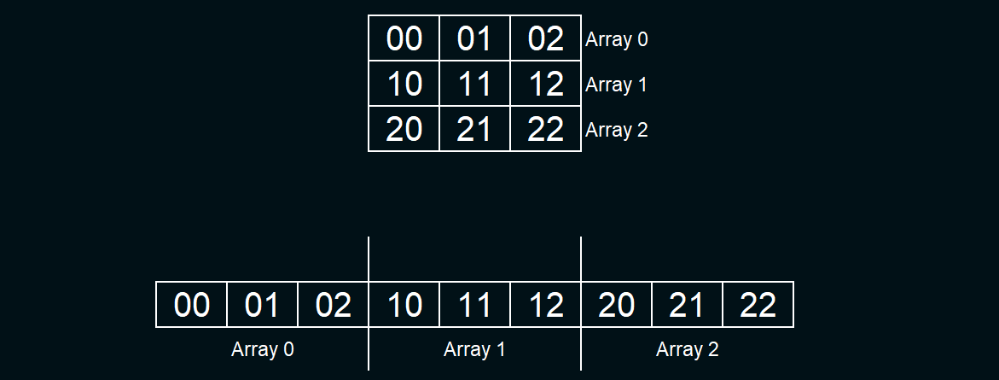
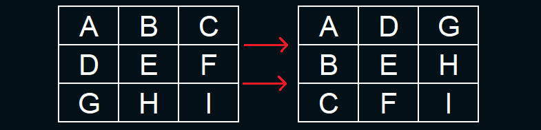
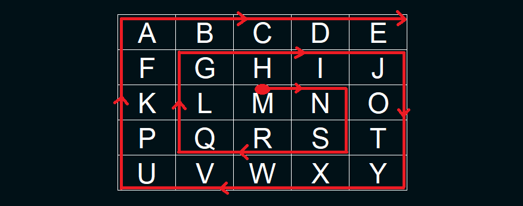
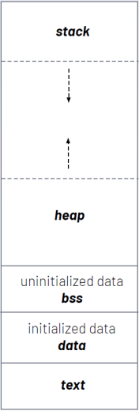

# Introducción

## Indice

- [Introducción](#introducción)
  - [Indice](#indice)
  - [Parciales](#parciales)
  - [Información Extra](#información-extra)
- [Clase 1](#clase-1)
  - [Buenas Practicas](#buenas-practicas)
  - [Crear Librerias](#crear-librerias)
  - [Tipos de Datos](#tipos-de-datos)
  - [Punteros](#punteros)
    - [Definición](#definición)
    - [Ejemplo de Uso](#ejemplo-de-uso)
- [Clase 2 - Vectores](#clase-2---vectores)
  - [Administración del Espacio](#administración-del-espacio)
  - [Buenas Practicas](#buenas-practicas-1)
  - [Retornar Tamaño](#retornar-tamaño)
  - [Aritmetica de Punteros](#aritmetica-de-punteros)
- [Clase 3 - Matrices](#clase-3---matrices)
  - [Compresión del Proceso Interno de una Matriz](#compresión-del-proceso-interno-de-una-matriz)
  - [Recorrido de Matrices](#recorrido-de-matrices)
  - [Eliminar Constantes](#eliminar-constantes)
- [Clase 4 - Cadenas](#clase-4---cadenas)
  - [Tipo de Dato Char](#tipo-de-dato-char)
  - [Tipo de Dato Cadena](#tipo-de-dato-cadena)
  - [Recorrido de una Cadena](#recorrido-de-una-cadena)
  - [Funciones de la libreria `string.h`](#funciones-de-la-libreria-stringh)
- [Clase 5 - Memoria Dinamica](#clase-5---memoria-dinamica)
  - [Sección de Memoria de la CPU](#sección-de-memoria-de-la-cpu)
  - [Uso Practico de la Memoria Dinamica](#uso-practico-de-la-memoria-dinamica)
  - [Uso Practico con Matrices](#uso-practico-con-matrices)
- [Clase 6](#clase-6)
  - [Reservar Espacio ya Asignado](#reservar-espacio-ya-asignado)
  - [Macros](#macros)
  - [Argumentos al Main](#argumentos-al-main)
  - [Función con Tipo de Dato Universal](#función-con-tipo-de-dato-universal)
  - [Copiar Bloque de Memoria](#copiar-bloque-de-memoria)
- [Clase 7](#clase-7)
  - [funcion insertar ordenado generico](#funcion-insertar-ordenado-generico)
  - [Algoritmo de Ordenamiento (metodo seleccion)](#algoritmo-de-ordenamiento-metodo-seleccion)
  - [Busqueda Binaria](#busqueda-binaria)
  - [Estructuras](#estructuras)
    - [Tamaño de la Estructura](#tamaño-de-la-estructura)
    - [Uso de Punteros](#uso-de-punteros)
- [Clase 8](#clase-8)
  - [Tipos de Archivos](#tipos-de-archivos)
  - [Manipulacion de Archivos](#manipulacion-de-archivos)
  - [Lectura de Archivos de Texto no Estructurado](#lectura-de-archivos-de-texto-no-estructurado)
  - [Lectura de Archivos de Texto Estructurado Variable](#lectura-de-archivos-de-texto-estructurado-variable)
  - [Lectura de Archivos de Texto Estructurado Fijo](#lectura-de-archivos-de-texto-estructurado-fijo)

## Parciales

- 1 Parcial (laboratorio con CodeBlocks)
- 1 TP Grupal. Defensa oral (20 minutos) y 3-5 personas
- 1 Recuperatorio

## Información Extra

- **Profesores:** Pablo Soligo
- **Alumno:** Tiago Pujia
- **Comisión:** 2600 (martes tarde)
- **Fecha Inicio:** 13/08/2024
- **[Clases Grabadas](https://youtube.com/playlist?list=PLENvh_JZMnA6n-wdPgmxpLHa4OBW7Qxxo&si=8chccEFcD95x4y22)**
- **[Apunte(este mismo)](https://github.com/Tiago-Pujia/Apunte-Topicos-Programacion)**

---

# Clase 1

_Realizar Ejercicios hasta el 6_

## Buenas Practicas
- Separar todo por Funciones
- Hacer las funciones lo mas flexible posible para que sea utilizado por otros
- Separar por librerias
- Usar debugger
- Comentar Codigo

## Crear Librerias
Vamos a tener 2 archivos que son recomendados tenerlos en una carpeta llamada "libs":
- `nombre.c` - Incluimos las funciones que vamos agregar al proyecto
- `nombre.h` - Incluimos los prototipado y el include del archivo.c

Luego para incluirlo dentro del main hacemos uso de: `#include "libs/nombre.h"`

## Tipos de Datos
El tipo de archivo numero (int) se le puede hacer ciertas modificaciones para modificar la longitud de bits o si esta con signo. Las clausulas se colocan detras del int.

- **Numeros Signados**

El 1° bit indica el signo

|Tipo de Dato|Formato|Tamaño(bits)|Rango|
|---|---|---|---|
|signed char|%hhd|8|[-128 ; 127]|
|short int|%hd|16|[-32,768 ; 32,767]|
|int|%d|32|[-2,147,483,648 ; 2,147,483,647]|
|long long int|%lld|64|[-9,223,372,036,854,775,808 ; 9,223,372,036,854,775,807]|

- **Numeros sin Signar**

|Tipo de Dato|Formato|Tamaño(bits)|Rango|
|---|---|---|---|
|unsigned char|%hhu|8|[0 ; 255]|
|unsigned short int|%hu|16|[0 ; 65,536]|
|unsigned int|%u|32|[0 ; 4,294,967,295]|
|size_t |%u|32|[0 ; 4,294,967,295]|
|unsigned long long int|%llu|64|[0 ; 18,446,744,073,709,551,615]|

- **Numeros Flotantes**

|Tipo de Dato|Formato|Tamaño(bits)|Rango|
|---|---|---|---|
|float|%f o %e o %g|32|[±3.4×10^38 ; ±1.2×10^-38]|
|double|%f o %e o %g|64|[±1.7×10^308 ; ±2.2×10^-308]|
|long double|%Lf o %Le o %Lg|96 - 152||

Mientras mejor categoria, mas precision de valor flotante

## Punteros

### Definición

Un puntero es una variable que almacena una dirección de memoria de otra variable dentro de la computadora. Se utiliza para la manipulación de variables desde diferentes funciones.

La variable que almacenará la dirección debe ser de tipo int e incluir el signo "\*". Para obtener la dirección de una variable, utilizamos el operador "&". Además, podemos utilizar el operador "\*" delante de una variable que contiene una dirección para acceder al valor almacenado en esa dirección, cualquier operación implica el valor original. Ejemplo:
~~~c
char nombre = 'T';
int *direccionNombre = &nombre;

printf("Direccion de Memoria: %u\n",direccionNombre);
printf("Valor de la dirección: %c\n", *direccionNombre)
~~~

### Ejemplo de Uso

El siguiente programa no permite modificar el contenido de la variable "valor" dentro de la función, realiza una copia:

~~~c
void miFuncion(char valor)
{
    valor = 'U';
    printf("Valor: %c\n",valor);
}

int main()
{
    char valor = 'R';

    miFuncion(valor);
    printf("Valor: %c\n",valor);

    return 0;
}
~~~

~~~
Resultado:
Valor: U
Valor: R
~~~

Para poder realizar eso querido debemos:
~~~c
void miFuncion(int *valor)
{
    *valor = 'U'; // Modificamos el valor original
}

int main()
{
    char valor = 'R';

    miFuncion(&valor); // Pasamos la dirección como argumento
    printf("Valor: %c\n",valor);
}
~~~
~~~
Resultado:
Valor: U
Valor: U
~~~

---

# Clase 2 - Vectores

## Administración del Espacio

Al momento de crear un array de N elementos, se reservan en memoria N cantidad de espacios multiplicado por el tamaño del tipo de dato; N*sizeof(tipo dato). Ejemplo:
~~~c
int vector[5];
~~~
El tipo int ocupa 4 bytes. Por lo tanto reservamos 5*4(bytes)=20 bytes.

## Buenas Practicas

Es buena practica definir el tamaño del array mediante constantes define. Ejemplo:
~~~c
#define TAM 50

int vector[TAM] = {4,3,6};
size_t cantEl = 3;

mostrarVec(vec,cantEl);
~~~

## Retornar Tamaño

Podemos saber la cantidad de elementos que tiene un array que tiene con la siguiente formula:
~~~c
sizeof(vector)/sizeof(int);
~~~
sizeof retorna tamaño, en este caso el tamaño del vector (5*4=20) y del tipo int(4 bytes). Por lo que ya no es necesario pasar a una función el tamaño del array.

## Aritmetica de Punteros

Debemos hacer el uso aritemtica de punteros en cadenas y arrays, y evitar utilizar subindices. Para esto, indicamos con el puntero la posición del inicio `*vec` y despues en el ciclo lo vamos incrementando `vec++`. Ejemplo:
~~~c
void mostrarVectorEntero(int *vec, size_t longitud)
{
    int *fin = vec + tamanio;

    while(vec < fin)
    {
        printf("%d\n", *vec);
        vec++;
    }
}
~~~

---

# Clase 3 - Matrices

## Compresión del Proceso Interno de una Matriz

Para una mejor comprensión de cómo funcionan las matrices NxN utilizando punteros, es importante entender que cada matriz se almacena en memoria de manera continua. Los elementos de cada fila se colocan uno tras otro, formando una secuencia lineal.

Esto quiere decir que para acceder a un elemento de un array de debe utilizar un doble puntero al estilo `*(*(matriz+F)+C)`, donde con F indicamos la fila y C la columna. Ejemplo:
~~~c
int matriz[3][3] = {
    {00,01,02},
    {10,11,12},
    {20,21,22}
};
    
printf("%d",*(*(matriz+1)+2));
// Resultado: 12
~~~

Aunque no es obligatorio el uso de punteros para matrices, pero si para arrays y cadenas.

## Recorrido de Matrices

La optimización de la manera de recorrer las matrices es muy importante.

- **Recorrer Triangulo de Matriz**

~~~c
size_t i, j;

// Recorrido de Matriz Triangular
for(i = 1 ; i < f ; i++)
    for(j = 0 ; j < i ; j++)
        printf("%d ",matriz[i][j]);

// Recorrido de Matriz Triangular + Diagonal Principal
for(i = 0 ; i < tamanio ; i++)
    for(j = 0 ; j <= i ; j++)
        printf("%d ",matriz[i][j]);
~~~

También podemos utilizar una técnica llamada _Matriz Espejada_, en la que podemos acceder a la casilla espejo de la posición en la que nos encontramos para diferentes usos. Solo necesitamos intercambiar `i (F)` y `j (C)` al recorrer la matriz de manera triangular.

~~~c
for(i = 1 ; i < f ; i++)
    for(j = 0 ; j < i ; j++){
        printf("Valor: %d" , matriz[i][j] );
        printf("Espejado: %d" , matriz[j][i] );
    }
~~~

- **Saber si es Matriz Identidad**

La matriz identidad es aquella donde solo tiene 0 en todas las casillas y 1 en la diagonal principal.

~~~c
size_t i, j;

// Chequear Diagonal Principal
for(i = 0 ; i < f ; i++)
    if(1 != matriz[i][i])
        return 0;

// Chequear Triangulos con Espejado
for(i = 1 ; i < f ; i++)
    for(j = 0 ; j < i ; j++)
        if(0 != matriz[i][j] || 0 != matriz[j][i])
            return 0;

return 1;
~~~

O incluso para que quede mas optimizado se puede unir en 1 solo el bucle:
~~~c
int i, j;
for(i = 1 ; i < f ; i++)
    for(j = 0 ; j < i ; j++)
        if(0 != *(*(matriz+i)+j) || 0 != *(*(matriz+j)+i) ||1  != *(*(matriz+i)+i))
            return 0;

return 1;
~~~

- **Transponer Matriz**

Transponer una matriz es el proceso de intercambiar filas por columnas. Esto significa que el elemento que está en la posición (i, j) pasa a la posición (j, i). Ejemplo:

La optimización para transponer una matriz cuadrada consiste en aprovechar el recorrido triangular, es decir, solo intercambiar los elementos que estan por fuera de la diagonal principal (ya que la diagonal principal permanece intacta). Hacemos uso del espejado de matriz junto una variable auxiliar al momento de realizar el intercambio.

~~~c
void transponerMatriz(char matriz[][COL_MAX], int tamanio) {
    size_t i, j;
    char aux;

    // Recorre la matriz de manera triangular
    for(i = 1 ; i < tamanio ; i++)
        for(j = 0 ; j < i ; j++)
        {
            // Intercambia los elementos de forma 
            // espejada con una variable auxiliar
            aux = matriz[i][j];
            matriz[i][j] = matriz[j][i]:
            matriz[j][j] = aux;
        }
}
~~~

- **Recorrido en Espiral** (desde dentro hacia afuera)
 

Hacer uso de topes donde decidimos los limites dentro de la matriz (limite superior, inferior, izquierdo y derecho)

- **Recorrido en Espiral** (desde afuera hacia adentro)

## Eliminar Constantes

Podemos eliminar la predefinicion de tamaños de matrices con constantes para hacerlo de uso en bibliotecas, globales para cualquier matriz. Ejemplo de error:

~~~c
#define TAM_COL 4
#define TAM_FIL 4

void mostrarMatriz(int matriz[][TAM_COL],int f, c);
~~~

Una opción posible es poner una constante de tamaño maximo con un numero muy grande. Teniendo la desventaja que reservamos memoria que no se va a utilizar, pero es lo que se utiliza (por ahora) hasta la unidad de memoria dinamica.

~~~c
#define MAX_COL 50
#define MAX_FIL 50

// Una matriz identidad es siempre cuadrada, tan solo le pasamos un parametro
void es_identidad(int matriz[][MAX_COL],int tamanio);

int main()
{
    int resultado;
    int matriz[MAX_FIL][MAX_COL] = {
        {1,0,0},
        {0,1,0},
        {0,0,1}
    }

    resultado = es_identidad(matriz,3);
    printf("Identidad: %d",resultado);
}
~~~

---

# Clase 4 - Cadenas

## Tipo de Dato Char

Tipo de dato que ocupa 8 bits (1 byte) donde podemos representar valores de la tabla ASCII haciendo uso de las comillas simples. Como dentro contiene valores numericos, podemos hacer operaciones arimeticas. Ejemplo:

~~~c
char x = 'a' + 1;
// resultado = b
~~~

## Tipo de Dato Cadena

Tipo de dato compuesto por un array del tipo char, donde al final termina con el caracter nulo `'\0'`, este indica cuando termnina la cadena. 

La Representación Burocratica creamos un array formal e indicamos posición por posición el valor que tendra la cadena en esa posición indicando el caracter nulo:

~~~c
char cad[5] = {'H','o','l','a','\0',}
~~~

La representación comun indicamos el texto mediante comillas dobles y el tamaño de la cadena y el caracter nulo se asignan solos.

~~~c
char cad[] = "Hola";
~~~

Se puede hacer el uso de punteros pero no es recomendao. Por que crea la cadena de manera constante (no puede ser modificada en ningun sentido). Ejemplo:

~~~c
char *cad = "Hola";
~~~ 

## Recorrido de una Cadena

El recorrido de una cadena se debe utiliar fundamentalmente la logica de punteros, solo que en una cadenas es mas sencillo. Ejemplo:

~~~c
// Devuelve la longitud de una cadena.
int strlen(char* str)
{
    const char* ini = str;
    while(*str)
        str++;
    return str-ini;
}
~~~

Para recorrer una cadena de principio a fin('\0') tan solo hacemos uso de un while donde verificamos si es correcto el valor donde se encuentra posicionado el array, la unica manera que no lo sea es si el caracter nulo que en ascii es 0. Luego, dentro del bucle vamos aumentando la posición del puntero.

Si queremos obtener la cantidad de posiciones recorridas, debemos crear una variable con la dirección de memoria original del vector, y restamos la direccón nueva con la original.

Este recorrido es mas eficiente que utilizar una variable de incremento "i".

## Funciones de la libreria `string.h`

Las funciones de las librerias tendran que ser creadas a mano, no estara permitido el uso de estas. Exceptuando funciones que van mas alla de C como "scanf"

- `strlen`

Devuelve la longitud de una cadena.

~~~c
size_t strlen(char* str)
{
    // Guarda la dirección inicial del string en el puntero 'ini'.
    const char* ini = str;

    // Recorre el string hasta llegar al carácter nulo '\0'.
    while(*str)
        str++;

    // Calcula la longitud restando la dirección inicial de la final.
    return str-ini;
}
~~~

- `strcat`

Concatena/Añande una cadena detras de otra, uniendolas.

~~~c
char* strcat(char *destino, char *origen)
{
    // Guarda la dirección inicial del destino para retornarla al final.
    char *ini = destino;

    // Avanza el puntero 'destino' hasta el final de la cadena actual.
    while(*destino)
        destino++;

    // Copia los caracteres de 'origen' a 'destino' hasta encontrar el carácter nulo.
    while(*origen)
    {
        *destino = *origen; // Asigna el carácter actual de 'origen' a 'destino'.
        destino++;          // Avanza el puntero 'destino'.
        origen++;           // Avanza el puntero 'origen'.
    }

    // Añade el carácter nulo al final de la nueva cadena concatenada.
    *destino = '\0';

    // Retorna el puntero inicial de 'destino'.
    return ini;
}
~~~

- `strcpy`

Realiza una copia del contenido de un string a otro string.

~~~c
void strcpy(char *destino, char *origen)
{
    // Copia cada carácter de 'origen' a 'destino' mientras no sea el carácter nulo.
    while(*origen)
    {
        *destino = *origen; // Asigna el carácter actual de 'origen' a 'destino'.
        destino++;          // Avanza el puntero 'destino'.
        origen++;           // Avanza el puntero 'origen'.
    }
    *destino = '\0'; // Añade el carácter nulo al final de la cadena copiada.
}
~~~

- `strchr`

Se utiliza para buscar la primera aparición de un carácter

~~~c
int strchr(char *str, const char buscar)
{
    const char *ini = str; // Guarda el puntero inicial de la cadena.
    while (*str) { // Itera mientras no se alcance el carácter nulo.
        if (*str == buscar) // Si el carácter actual es igual a 'buscar'.
            return str - ini; // Retorna la posición relativa en la cadena.
        str++; // Avanza el puntero a la siguiente posición.
    }
    return -1; // Si no se encuentra el carácter, retorna -1.
}
~~~

- `strrchr`

Se utiliza para buscar la ultima aparición de un carácter

~~~c
int strrchr(char *str, const char buscar)
{
    int posicion = -1;  // Inicializa la posición como -1
    const char *ini = str; // Guarda la dirección inicial de la cadena

    // Recorre la cadena hasta que se llega al final ('\0')
    while (*str) {
        // Si el carácter actual es el buscado, actualiza la posición
        if (*str == buscar)
            posicion = str - ini; // Calcula la posición actual del carácter buscado

        str++; // Avanza al siguiente carácter de la cadena
    }

    // Retorna la última posición encontrada, o -1 si no se encontró
    return posicion; 
}
~~~

- `strcmp`

Compara 2 cadenas y devuelve el resultado, estos pueden ser:
- str1 = str2 => 0 (cero)
- str1 > str2 => Numero Positivo
- str1 < str2 => Numero Negativo

~~~c
int strcmp(const char *str1, const char *str2)
{
    // Compara los caracteres de ambas cadenas mientras sean iguales y no lleguen al final.
    while(*str1 == *str2 && *str1 && *str2)
    {
        str1++; // Avanza en la cadena 1.
        str2++; // Avanza en la cadena 2.
    }

    return *str1 - *str2; // Retorna la diferencia entre los primeros caracteres diferentes.
}

char c1 = "Alo A",
     c2 = "Alo B";
strcmp(c1,c2);
// Resultado = A(65) - B(66) = -1

~~~

- `strncmp`

Se utiliza para comparar los primeros "n" caracteres de dos cadenas.

~~~c
int strncmp(const char* str1, const char* str2, size_t bytes)
{
    // Mientras ambas cadenas no lleguen al final y queden bytes por comparar
    while(*str1 && *str2 && bytes)
    {
        // Si los caracteres actuales no coinciden, retorna la diferencia
        if(*str1 != *str2)
            return *str1 - *str2;

        str1++;     // Avanza al siguiente carácter
        str2++;     // Avanza al siguiente carácter
        bytes--;    // Decrementa el número de bytes a comparar
    }

    // Si una cadena termina antes o no se agotaron los bytes, retorna la diferencia
    return *str1 - *str2;
}
~~~

- `strncpy`

Se utiliza para copiar hasta "n" caracteres de una cadena a otra.

~~~c
void strncpy(char *destino, char *origen, size_t bytes)
{
    // Copia cada carácter de 'origen' a 'destino' mientras no sea el carácter nulo.
    while(*origen && bytes)
    {
        *destino = *origen; // Asigna el carácter actual de 'origen' a 'destino'.
        destino++;          // Avanza el puntero 'destino'.
        origen++;           // Avanza el puntero 'origen'.
        bytes--;
    }
    *destino = '\0'; // Añade el carácter nulo al final de la cadena copiada.
}
~~~

- `strstr`

~~~c
char* strstr(const char *str1, const char *str2)
{

}
~~~

---

# Clase 5 - Memoria Dinamica

## Sección de Memoria de la CPU

Dentro de la memoria de la CPU, se encuentra dividia por varias secciones:
1. `text` - Almacena las instrucciones en lenguaje ensamblador (Assembly).
2. `data` - Almacena datos inicializados; variables globales de Assembly
3. `bss` - Almacena datos no inicializados; variables globales al inicio del programa
4. `heap` (memoria dinamica) - Asignación de memoria en tiempos de ejecución
5. `stack` (pila) - Almacena variables locales y en el contexto de las funciones.

En este caso, los importante son pila (stack) y la memoria dinamica (heap). En la pila se crean nuestras variables en C, las cuales almacenan direcciones que apuntan a la sección de memoria dinámica, donde se encuentra el contenido de la variable. La pila se reserva y libera de manera automatica, pero la memoria dinamica debe ser manipulada completamente por el usuario.

La pila tiene un tamaño máximo de 2 MB en Windows y 8 MB en Linux. La memoria dinámica (heap), como su nombre lo indica, no tiene un espacio reservado fijo, sino que puede expandirse en tiempo de ejecución según las necesidades del programa.

La ventaja de este método es que, cuando una variable o función finaliza, se libera el espacio en la memoria, permitiendo su reutilización en futuras llamadas. De esta manera, el contenido de nuestro programa se mantiene en los registros de la CPU, evitando la necesidad de acceder a la caché, RAM o ROM. Además, nos permite eliminar la restricción de un tamaño máximo fijo para estructuras como matrices, permitiendo definir su tamaño en tiempo de ejecución.

## Uso Practico de la Memoria Dinamica

1. Creamos una variable puntero que guardará la dirección de la memoria dinámica.

2. Usamos la función `malloc(tamaño_bytes)`, que se utiliza para reservar memoria en la sección de memoria dinámica. Esta función retorna la dirección de la memoria asignada. Debemos especificar el tamaño (en bytes) de la memoria que queremos reservar, para lo cual utilizamos `sizeof`. Es importante verificar si malloc devolvió una dirección válida.

3. Una vez que hemos asignado la dirección, podemos asignar nuestros valores, los cuales se guardarán en la memoria dinámica. Para ello, usamos la sintaxis *variable = ....

1. Cuando terminamos de usar esta memoria, debemos liberarla con la función `free(dirección)` para evitar fugas de memoria.

**Ejemplo:**

~~~c
int *pi; // Creamos nuestra variable tipo puntero
pi = malloc(sizeof(int)); // Apuntamos hacia una dirección heap

// Chequear que retorno una dirección de memoria
if(pi != NULL) 
{
    *pi = 7;
    // ... Hacemos lo que queramos con ella
    printf("Valor asignado %d en la direccion %u",*pi,pi);
} 
    
free(pi); // Liberamos la memoria
~~~

## Uso Practico con Matrices

Haciendo uso de este concepto, podemos crear matrices de tamaño dinámico, permitiendo funciones más flexibles sin depender de técnicas que limitan el tamaño máximo de columnas y filas. A cada función que manipula la matriz debemos pasarle un puntero a un puntero, por ejemplo: `int **matriz`, indicando que se trata de una matriz.

- **`Liberar Memoria`**

Para liberar la memoria, recorremos cada fila y la liberamos una por una. Luego de liberar cada fila, liberamos el arreglo de punteros que apuntan a las filas.

~~~c
void liberarMatriz(int** matriz, const int filas) {
    for (int i = 0; i < filas; i++) // Liberar cada fila
        free(*(matriz+i));
    free(matriz); // Liberar el arreglo de punteros
}
~~~

- **`Crear Matriz`**

Usamos malloc inicialmente para crear la matriz, reservando espacio para el arreglo de punteros a filas (int*). Luego, recorremos cada fila y reservamos espacio en memoria según la cantidad de columnas. Es importante siempre verificar si hay errores durante la asignación de memoria.

~~~c
int **crearMatrizInt(size_t filas, size_t columnas)
{
    size_t i, j;
    int **matriz = (int**) malloc(filas * sizeof(int*));

    // Verificar si se retorno la dirección
    if(matriz == NULL) 
        return NULL;
    
    // asignamos memoria para cada fila (columnas)
    for(i = 0; i < filas ; i++) 
    {
        *(matriz+i) = (int*) malloc(columnas * sizeof(int));

        // Si ocurrio un error, liberamos toda la memoria
        if(*(matriz+i) == NULL)
        {
            liberarMatriz(matriz,i);
            return NULL;
        }
    }

    return matriz;
}
~~~

La ventaja de usar este método es que podemos definir un tamaño diferente de columnas para cada fila, creando matrices irregulares si es necesario.

---

# Clase 6

## Reservar Espacio ya Asignado

`realloc()` se utiliza para redimensionar el tamaño de un bloque de memoria previamente asignado por malloc sin perder memoria. Recibe como primer parametro el puntero de memoria ya asignado y segundo el espacio nuevo que puede ser mayor o menor que la original:

~~~c
void *realloc(void *ptr, size_t new_size);
~~~

- **ptr**: Un puntero a un bloque de memoria previamente asignado.
- **new_size**: El nuevo tamaño que se desea para el bloque de memoria en bytes.

~~~c
// Reserva inicial de memoria
int *arr = (int*) malloc(5 * sizeof(int));

// Asignar valores
for (int i = 0; i < 5; i++)
    arr[i] = i + 1; // 1, 2, 3, 4, 5

// Aumentar el tamaño a 10
arr = (int*) realloc(arr, 10 * sizeof(int));

// Inicializar nuevos valores
for (int i = 5; i < 10; i++)
    arr[i] = i + 1; // 6, 7, 8, 9, 10

// Imprimir valores
for (int i = 0; i < 10; i++)
    printf("%d ", arr[i]);

// Liberar memoria
free(arr);
~~~

## Macros

El compilador al ver un codigo escrito con hash `# define / include`, lo que hace es copiar y pegar el contenido/archivo, a nuestro archivo donde se lo esta llamando. Las macros pueden ser de 2 tipos:

- **Macros Simples (constantes)**

Sirven para definir valores constantes que se pueden utilizar en el código. Estas constantes son reemplazadas por su valor literal en el código fuente antes de que el compilador procese el programa:

~~~c
#define NOMBRE_VALOR valor
~~~

- **Macros con Parametros (similar a funcion)**

Estas macros pueden aceptar parámetros y se comportan como funciones en tiempo de preprocesamiento. El preprocesador simplemente reemplaza el uso de la macro por el código correspondiente, con los parámetros sustituidos por los valores dados.

~~~c
#define NOMBRE_MACRO(parametro1, parametro2) (parametro1 + parametro2)
~~~

Ejemplo:

~~~c
# define MAX(X,Y) (X) > (Y) ? (X) : (Y)

printf("El maximo es: %d",MAX(50,10));
// Resultado = El maximo es 50
~~~

Hay que tener cuidado con el uso de parametros, siempre debemos encapsular con parentesis cada contenido que se le manda como parametro.

## Argumentos al Main

El main tiene ninguno o 2 parametros:

`int main(int argc,char* argv[])`

- **argc** = cantidad de argumentos del array
- **argc[] = Todos los elementos con cadenas de caracteres

Si queremos imprimir el contenido debemos:
~~~c
int main(int argc, char*argv[])
{
    int i;

    for(i=0 ; i < argc ; i++)
    {
        printf("%s\n", argv[i]);
    }
}

// Resultado: D:\git\programacion\apunte\ejecutado.exe
// En este caso retorna la ruta del ejecutable
~~~

Es un uso que se le da unicamente a los programadores porque tiene la caracteristica que se le puede ingresar datos como un scanf sin necesidad de llamarlo, y el contenido que se escribe en consola se guarda en el array.

## Función con Tipo de Dato Universal

Para esto hacemos uso del tipo de dato puntero generico `void*` para los parametros y retorno, permitiendo pasar diversos datos sin preocuparse por el tipo.

El incremento del puntero debemos hacerlo a mano (el compilador no va a entenderlo), por lo tanto si enviamos a otra función debemos especificar el tamaño del tipo de dato que utiliza, como al igual el incremento de este debe de ser a mano. Ejemplo:

Ejemplo:
~~~c
void mostrarVector(void *vec, size_t longitud, size_t tamanio)
{
    void *fin = vec + longitud * tamanio;

    while(vec < fin)
    {
        printf("%d "); // ERROR
        vec += tamanio;
    }
}

int main()
{
    int vec[] = {0,1,2,3};
    size_t  tamanio = sizeof(*vec), longitud = sizeof(vec) / tamanio;

    mostrarVector(vec,longitud,tamanio);

    return 0;
}
~~~

El problema que tiene es que para mostrar en consola el valor no es posible, por lo que para solucionarlo se le pasa como argumento la dirección de una función para imprimir ese tipo de dato especifico (mostrarEntero, mostrarChar, etc...). Ejemplo:

~~~c
void mostrarEntero(void *elemento)
{
    int *elementoTransformado = (int*)(elemento);
    printf("%d",*elementoTransformado);
}

void* mostrarVector(void *vec, size_t longitud, size_t tamanio, void mostrar(void*))
{
    void *fin = vec + longitud * tamanio;

    while(vec < fin)
    {
        mostrar(vec);
        printf(" ");
        vec += tamanio;
    }
    printf("\n");
}

int main()
{
    int vec[] = {0,1,2,3};
    size_t  tamanio = sizeof(*vec),
            longitud = sizeof(vec) / tamanio;

    mostrarVector(vec,longitud,tamanio,mostrarEntero);

    return 0;
}
~~~

## Copiar Bloque de Memoria

`memcpy` y `memmove` son funciones utilizada para copiar bloques de memoria de un lugar a otro. Ambas tienen una diferencia pero reciben los mismos parametros:

~~~c
void* memcpy(void* destino, const void* origen, size_t num);
~~~

~~~c
memmove(void* destino, const void* origen, size_t num);
~~~

**Parametros:**
1. **destino**: Puntero al bloque de memoria donde se copiaran los datos 
2. **origen**: Puntero al bloque de memoria que se copiara
3. **num**: Numero de bytes a copiar

Retorna el puntero del destino

Ejemplo:
~~~c
char origen[20] = "Hola, Mundo!";
char destino[20];
unsigned int tamanio = sizeof(char), longitud = longitudCadena(origen) + 1;

memcpy(destino, origen, longitud);  

printf("%s\n",origen);
printf("%s",destino);
~~~

La diferencia en ambas funciones es que memcpy no es seguro para areas de memoria que se superponen. Por lo tanto memmove es mas seguro pero memcpy es mas rapido.

El codigo fuente de cada uno:

~~~c
void* memcpy(void* destino, const void* origen, size_t bytes)
{
    // Si destino y origen son iguales, no hay nada que hacer.
    if (destino == origen)
        return destino;

    // Declara punteros para recorrer el destino y el origen como bytes.
    unsigned char *d = destino;
    const unsigned char *o = origen;
    
    // Calcula la dirección final del bloque de memoria que se copiará.
    const unsigned char *fin = o + bytes;

    // Copia byte por byte desde 'origen' a 'destino' hasta llegar al final.
    while(o < fin)
    {
        *d = *o;  // Copia el byte actual de origen a destino.
        d++;      // Avanza el puntero de destino.
        o++;      // Avanza el puntero de origen.
    }

    return destino; // Retorna el puntero al bloque de destino.
}
~~~

~~~c
void* memmove(void* destino, const void* origen, size_t bytes)
{
    // Si destino y origen son iguales, no hay nada que hacer.
    if (destino == origen)
        return destino;

    // Reserva un bloque de memoria auxiliar del tamaño de 'bytes'.
    void *aux = malloc(bytes);

    // Verifica si la reserva de memoria fue exitosa.
    if (!aux)
        return NULL;  // Si no se pudo asignar memoria, retorna NULL.

    // Copia los datos del origen a la memoria auxiliar.
    memcpy(aux, origen, bytes);

    // Copia los datos de la memoria auxiliar al destino.
    memcpy(destino, aux, bytes);

    // Libera la memoria auxiliar.
    free(aux);

    // Retorna el puntero al bloque de memoria destino.
    return destino;
}
~~~

~~~c
int memcmp(const void *dir1, const void *dir2, size_t bytes)
{
    // Convertimos los punteros a char para hacer comparaciones byte a byte.
    const unsigned char *dirChar1 = dir1;
    const unsigned char *dirChar2 =  dir2;

    // Calculamos el final de la región a comparar.
    const unsigned char *fin = dirChar1 + bytes; 

    // Recorremos byte a byte las dos regiones de memoria.
    while (dirChar1 < fin)
    {
        // Comparamos los bytes de ambas direcciones.
        if (*dirChar1 != *dirChar2)
            // Retorna la diferencia si los bytes son distintos.
            return *dirChar1 - *dirChar2; 

        // Avanzamos al siguiente byte.
        dirChar1++;
        dirChar2++;
    }

    // Si todas las comparaciones fueron iguales, retornamos 0.
    return 0;
}
~~~

# Clase 7

## funcion insertar ordenado generico

~~~c
int comparacionInt(void* el1, void* el2)
{
    int *elInt1 = (int*)(el1), *elInt2 = (int*)(el2);
    return *elInt1 - *elInt2;
}

int instVecOrd(void *vec, size_t longitud, size_t tamanio, size_t *ce, int comparacion(void*,void*), void* ingresar)
{
    if(*ce >= longitud && comparacion(ingresar,vec + (*ce-1) * tamanio) > 0)
        return NULL; // Si el array está lleno y el valor es mayor que el último, no inserta

    void *ini = vec; // Puntero al inicio del array
    vec += *ce == longitud ? *ce * tamanio - 1 : *ce * tamanio; // Puntero al final del array

    while(vec > ini && comparacion(ingresar, vec - tamanio) < 0) // Recorre desde el final hacia el inicio buscando la posición correcta
    {
        memcpy(vec, vec - tamanio, tamanio);
        vec -= tamanio;
    }

    memcpy(vec, ingresar, tamanio); // Inserta el nuevo valor en su posición
    if(*ce < longitud) (*ce)++; // Actualiza el contador de elementos

    return 1; // Indica que la inserción fue exitosa
}
~~~

## Algoritmo de Ordenamiento (metodo seleccion)

Metodo recomendado en caso que el vector sea muy grande

Vector a ordenador:

|Vec|7|5|9|2|1|
|-|-|-|-|-|-|
|Pos|0|1|2|3|4|

1. Funcion para buscar el elemento menor

~~~c
void intercambiarElementos(void *el1, void *el2, size_t tamanio)
{
    char aux;
    size_t i;
    for (i = 0; i < tamanio; i++)
    {
        aux = *(char*)el2;
        *(char*)el2 = *(char*)el1;
        *(char*)el1 = aux;
        el1++;
        el2++;
    }
}

// Función que busca el menor elemento en el vector a partir de una posición dada
void* buscarElementoMenor(void *vec, size_t longitud, size_t tamanio, int comparacion(const void*, const void*))
{
    size_t i;
    void *elementoMenor = vec; // Puntero al menor elemento encontrado
    vec += tamanio; // Puntero al elemento actual

    // Itera por cada elemento del vector comparando cuál es menor
    for (i = 1; i < longitud; i++)
    {
        if (comparacion(vec, elementoMenor) < 0)
            elementoMenor = vec;
        vec += tamanio; // Avanza al siguiente elemento
    }

    return elementoMenor; // Retorna la dirección del menor elemento
}

// Función que ordena un vector usando el método de selección con lógica genérica
void ordenarSeleccion(void *vec, size_t longitud, size_t tamanio, int comparacion(const void*, const void*))
{
    size_t i;
    void *elementoMenor;

    // Itera por cada elemento del vector para buscar su posición correcta
    for (i = 0; i < longitud; i++)
    {
        // Busca el menor elemento a partir de la posición actual
        elementoMenor = buscarElementoMenor(vec, longitud - i, tamanio, comparacion);
        
        // Si el menor elemento no está en la posición actual, intercambia
        if (elementoMenor != vec)
            intercambiarElementos(elementoMenor, vec, tamanio);
        
        // Avanza al siguiente elemento
        vec += tamanio; 
    }
}
~~~

## Busqueda Binaria

- **Explicacion:**

Exige que el vector este ordenado, pero es muy eficiente.

Queremos en el siguiente vector buscar el valor 15:

|Vec|3|6|9|12|15|18|
|-|-|-|-|-|-|-|
|Pos|0|1|2|3|4|5|

1. Nos paramos a la mitad del vector (pos 3)

> |Vec|3|6|9|**12**|15|18|
> |-|-|-|-|-|-|-|
> |Pos|0|1|2|**3**|4|5|

2. Comparamos si ese valor a la mitad es mayor o menor al valor a buscar

> 12 < 15

3. Si es mayor se va a la mitad apartir del medio partido, si es mayor se va a la mitad apartir del medio para atras

> |Vec|15|18|
> |-|-|-|
> |Pos|4|5|

4. Repetir la misma secuencia hasta encontrar el valor

- **Codigo:**

~~~c
void* busquedaBinaria(void* buscar, void* vec, size_t longitud, size_t tamanio, int comparacion(const void*, const void*)) {
    // Inicializa los punteros de inicio y fin que delimitan el rango de búsqueda
    void *mitad;                               // Puntero a la posición central actual
    void *inicio = vec;                        // Puntero al primer elemento del array
    void *fin = vec + (longitud - 1) * tamanio; // Puntero al último elemento del array
    
    int resultadoComparacion;  // Variable para almacenar el resultado de la comparación
    
    // El bucle continúa mientras el puntero de inicio no supere al puntero de fin
    while (inicio <= fin) {
        // Calcula la dirección de la mitad del rango actual utilizando aritmética de punteros
        mitad = inicio + ((fin - inicio) / (2 * tamanio)) * tamanio;
        
        // Compara el valor buscado con el valor en la posición de mitad
        resultadoComparacion = comparacion(buscar, mitad);
        
        // Si la comparación da cero, significa que hemos encontrado el valor
        if (resultadoComparacion == 0)
            return mitad;  // Devuelve el puntero al valor encontrado

        // Si el valor buscado es menor que el valor en la posición de mitad
        else if (resultadoComparacion < 0)
            fin = mitad - tamanio;  // Ajusta el puntero de fin para reducir la búsqueda a la mitad inferior

        // Si el valor buscado es mayor que el valor en la posición de mitad
        else
            inicio = mitad + tamanio;  // Ajusta el puntero de inicio para reducir la búsqueda a la mitad superior
    }
    
    // Si el bucle termina sin encontrar el valor, se retorna NULL
    return NULL;
}
~~~

Podemos hacer una prueba de la funcion con el codigo:

~~~c
int vec[] = {3,5,9,12,15};
int bus[] = {1,3,4,6,9,11,12,15,18};

for(int i = 0; i < sizeof(bus)/sizeof(*bus); i++)
    printf("~ Posicion en Memoria: %u\n",busquedaBinaria(bus+i,vec,sizeof(vec)/sizeof(*vec),sizeof(*vec),comparacionInt));
~~~

## Estructuras

### Tamaño de la Estructura

Las estructuras se siguen declarando de la misma manera, recordando que se debe tener cuidado al momento de contar a mano la cantidad de bytes que ocupa, debido que al final de cada estructura el S.O agrega un dato. Ejemplo:

~~~c
#define TAM 50

typedef
{
    int legajo;
    char nombre[TAM];
    float sueldo;
} EMPLEADO;

// sizeof(EMPLEADO) != 4(int) + 50(char[50]) + 4(float) = 58 bytes
~~~

### Uso de Punteros

Se le puede pasar como argumento a una funcion la dirección de memoria de la estructura, con el fin de no duplicar el dato que se utilizara y ahorrar recursos. La manipulacion del mismo con punteros es el mismo ya conocido, la unica diferencia es que para acceder a una propiedad mediante la direccion de memoria se utiliza la sintaxis de flecha `->` y no la del punto. Ejemplo:

~~~c
//Pasar direccion de memoria, porque si no realiza una copia del dato
int aumentarSueldo(EMPLEADO *emp) 
{
    EMPLEADO *he = (EMPLEADO*);
    // Hacemos uso de flecha para acceder una propiedad de puntero de estructura
    emp->sueldo += emp.sueldo * 1.10;
}
~~~

# Clase 8

"Hacer uso de la libreria qsort para ordenamiento"

Es un concepto en todo lenguaje de alto nivel no solo en C. Necesitamos una memoria auxiliar, para esto vamos a hacer uso de archivo.

## Tipos de Archivos

- Textos
  - No estructurado: cadena de gran tamaño.
  - Estructurado: Tipo utilizado para base de datos
    - Campo Variable: No hay un espacio reservado para cada campo, CSV es un ejemplo.
    - Campo Fijo: Cada campo tiene N bytes fijos.
- Binarios
  - Campo Fijo: Estructuras C (tipo mas eficiente)
  - Campo Variable (no se utiliza), audios es un ejemplo

## Manipulacion de Archivos

**Funciones Globales:**
- fopen("*nombre-txt*",*modo apertura*)

Abrir archivo. Modo que se utilizan: "w" y "r"

- fclose
- remove
- rename
- fputs

**Funciones Texto:**
- fgets
- fscanf
- fprintf
- sscanf
- sfprintf

**Funciones Binario:**
- fread
- fwrite
- fcof
- fseek
- ftell
- rewind

## Lectura de Archivos de Texto no Estructurado

## Lectura de Archivos de Texto Estructurado Variable

- Manera Manual (recomendado)

Hacemos uso del scanf para leer cada campo

- Manera Automatica

## Lectura de Archivos de Texto Estructurado Fijo